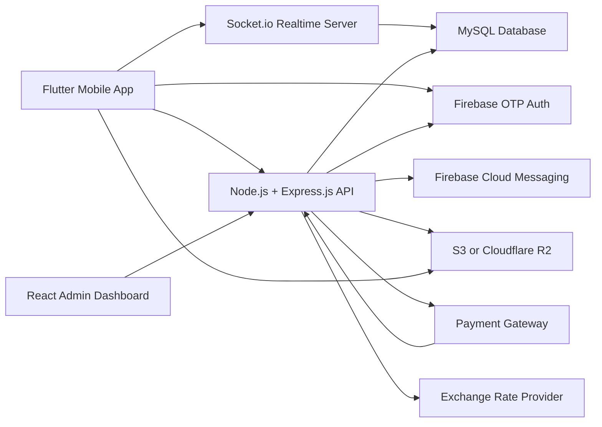

# INHOD Technical Architecture

Version: 1.0
Date: 2026-05-21
Status: Draft for engineering review

## 1. Architecture Summary

INHOD uses a mobile-first client architecture backed by a Node.js API, MySQL database, Firebase authentication, Firebase Cloud Messaging, Socket.io realtime services, object storage, payment gateway integration, and a React web admin dashboard.

Final selected architecture:

```text
Flutter Mobile App + React Admin Dashboard
    -> Node.js + Express.js REST APIs
    -> MySQL Database
    -> Socket.io Realtime
    -> Firebase OTP + FCM
    -> Payment Gateway
    -> AWS S3 or Cloudflare R2 Storage
```

MySQL is treated as the final database decision. PostgreSQL was mentioned in the initial stack notes, but the final architecture explicitly selects MySQL.

## 2. High-Level System Diagram



## 3. Core Components

### 3.1 Mobile App

Technology: Flutter.

Responsibilities:

- Firebase OTP login.
- User onboarding and profile management.
- Community discovery, creation, joining, and moderation.
- Feed, posts, likes, comments, reports, and saves.
- Event discovery, creation, RSVP, and event chat.
- One-to-one and community chat.
- Push notification handling.
- Moderator revenue dashboard and payout request flow.

### 3.2 Admin Dashboard

Technology: React.js or Next.js.

Responsibilities:

- Super Admin login and protected access.
- User management.
- Community management.
- Country, state, and city CRUD.
- Pricing, currency, exchange rate, and revenue split configuration.
- Reports and abuse management.
- Payment, wallet, and payout review.
- Analytics dashboards.

Recommendation:

- Use Next.js if server-side routing, admin auth middleware, and dashboard page structure are preferred.
- Use plain React with Vite if the admin panel is purely client-side behind API authentication.

### 3.3 Backend API

Technology: Node.js + Express.js.

Recommended implementation:

- TypeScript.
- Express.js REST API.
- MySQL ORM or query builder such as Prisma, Sequelize, TypeORM, or Knex.
- Validation with Zod, Joi, or class-validator.
- Background jobs with BullMQ and Redis if delayed notifications, exchange rate sync, and payout jobs are required.

Responsibilities:

- Verify Firebase ID tokens.
- Enforce role-based access control.
- Serve REST APIs.
- Handle payment gateway sessions and webhooks.
- Calculate pricing and revenue split.
- Manage wallet ledger.
- Store and retrieve feed, event, chat, and notification data.
- Send FCM push notifications.
- Generate admin analytics.

### 3.4 Database

Technology: MySQL.

Responsibilities:

- Store normalized application data.
- Preserve payment, wallet, and moderation audit history.
- Support search, filtering, pagination, and analytics queries.

Recommendations:

- Use migrations for every schema change.
- Use soft deletes for user-generated content and moderation-sensitive entities.
- Use immutable ledger records for wallet transactions.
- Use indexes on foreign keys, status fields, created timestamps, country/city IDs, and frequently searched names.

### 3.5 Realtime Layer

Technology: Socket.io.

Responsibilities:

- One-to-one chat.
- Community chat.
- Event chat.
- Live read receipts.
- Live notification events where useful.

Scaling recommendation:

- Use Redis adapter for Socket.io when running more than one realtime server instance.

### 3.6 Firebase

Firebase services:

- Firebase Authentication for mobile OTP.
- Firebase Cloud Messaging for push notifications.

Backend responsibilities:

- Verify Firebase ID tokens for mobile requests.
- Link Firebase UID to local user records.
- Store FCM device tokens.
- Send push notifications through FCM.

### 3.7 Storage

Technology options:

- AWS S3.
- Cloudflare R2.

Stored media:

- Profile photos.
- Community banners.
- Post images and videos.
- Event images.
- Chat media.

Recommended approach:

- Backend issues pre-signed upload URLs.
- Clients upload directly to object storage.
- Backend stores metadata and final object keys.
- Public or signed read URLs are generated based on content type and privacy rules.

### 3.8 Payment Gateway

Payment gateway is not finalized.

Recommended initial options:

- Stripe for global card support where available.
- Local gateways for first-launch markets if Stripe coverage or payout support is limited.

Backend responsibilities:

- Create checkout sessions or payment intents.
- Verify webhook signatures.
- Reconcile payment status.
- Create memberships only after confirmed payment.
- Create wallet transactions idempotently.

## 4. Authentication and Authorization

### 4.1 Mobile Authentication Flow

1. User enters mobile number in Flutter app.
2. Firebase sends OTP.
3. User verifies OTP in mobile app.
4. Flutter obtains Firebase ID token.
5. Flutter sends token to backend.
6. Backend verifies token with Firebase Admin SDK.
7. Backend finds or creates local user by Firebase UID and mobile number.
8. Backend checks account status.
9. Backend returns application session payload and profile completion state.

### 4.2 Admin Authentication

Recommended options:

- Separate admin auth with email/password plus MFA.
- Or Firebase/Auth provider with admin role stored in backend.

Admin authorization must be enforced by backend roles, not only by frontend routing.

### 4.3 Role Model

Core roles:

- user.
- community_founder.
- community_moderator.
- super_admin.

Role notes:

- All community founders are users.
- A user may moderate multiple communities.
- Moderator permissions are scoped to specific communities.
- Super Admin permissions are platform-wide.

### 4.4 Authorization Rules

Examples:

- Only active users can create posts, communities, events, reports, and chats.
- Only community members can view private community content.
- Only moderators can remove members or approve posts in their community.
- Only founders or authorized moderators can add moderators.
- Only Super Admins can configure platform pricing, countries, states, cities, and payout decisions.

## 5. Recommended Backend Module Structure

```text
src/
  app.ts
  server.ts
  config/
  modules/
    auth/
    users/
    locations/
    communities/
    memberships/
    payments/
    wallets/
    posts/
    comments/
    events/
    chats/
    notifications/
    reports/
    admin/
    analytics/
  realtime/
  jobs/
  storage/
  integrations/
    firebase/
    payment-gateway/
    exchange-rates/
  middleware/
  database/
  utils/
```

## 6. Data Model

### 6.1 Core Tables

| Table | Purpose | Important Fields |
| --- | --- | --- |
| users | Application user accounts. | id, firebase_uid, full_name, mobile_number, nationality_country_id, current_country_id, state_id, city_id, profession, profile_photo_url, status, profile_completed_at, created_at |
| user_languages | User language selections. | id, user_id, language_code, created_at |
| user_interests | User interest selections. | id, user_id, interest_id, created_at |
| interests | Master interests. | id, name, status |
| countries | Country master data. | id, name, iso_code, currency_code, phone_code, status |
| states | State/province master data. | id, country_id, name, code, status |
| cities | City master data. | id, country_id, state_id, name, status |
| community_categories | Community categories. | id, name, slug, status |
| communities | Community records. | id, founder_user_id, category_id, country_id, state_id, city_id, name, description, banner_url, rules, visibility, status, approval_required, join_fee_usd, created_at |
| community_members | Membership records. | id, community_id, user_id, status, joined_at, left_at, banned_at, membership_source |
| community_moderators | Scoped moderator roles. | id, community_id, user_id, role, status, added_by_user_id, created_at |
| community_settings | Community-specific settings. | id, community_id, post_approval_required, rejoin_policy, rejoin_free_days, allow_event_chat |

### 6.2 Feed Tables

| Table | Purpose | Important Fields |
| --- | --- | --- |
| posts | User and community posts. | id, user_id, community_id, scope, text, status, approval_status, created_at |
| post_media | Post media attachments. | id, post_id, media_type, storage_key, url, sort_order |
| comments | Post comments. | id, post_id, user_id, parent_comment_id, text, status, created_at |
| likes | Post/comment likes. | id, user_id, target_type, target_id, created_at |
| saved_posts | Saved posts. | id, user_id, post_id, created_at |
| post_shares | Share tracking. | id, user_id, post_id, share_target, created_at |

### 6.3 Events Tables

| Table | Purpose | Important Fields |
| --- | --- | --- |
| events | Meetup and event records. | id, community_id, creator_user_id, title, description, event_type, banner_url, starts_at, ends_at, timezone, location_name, map_place_id, latitude, longitude, capacity, status |
| event_attendees | RSVP records. | id, event_id, user_id, status, rsvp_at, cancelled_at |

### 6.4 Chat Tables

| Table | Purpose | Important Fields |
| --- | --- | --- |
| chats | Chat container. | id, chat_type, community_id, event_id, created_by_user_id, status, created_at |
| chat_participants | Chat membership. | id, chat_id, user_id, role, status, last_read_message_id, joined_at |
| messages | Chat messages. | id, chat_id, sender_user_id, message_type, body, media_url, status, created_at |
| message_reads | Per-user read receipts. | id, message_id, user_id, read_at |

### 6.5 Safety and Moderation Tables

| Table | Purpose | Important Fields |
| --- | --- | --- |
| reports | Abuse reports. | id, reporter_user_id, target_type, target_id, reason, details, status, assigned_admin_id, resolved_at |
| user_blocks | User block relationships. | id, blocker_user_id, blocked_user_id, created_at |
| moderation_actions | Audit trail of moderation actions. | id, actor_user_id, actor_role, target_type, target_id, action, reason, created_at |

### 6.6 Payment and Wallet Tables

| Table | Purpose | Important Fields |
| --- | --- | --- |
| payments | Payment records. | id, user_id, community_id, gateway, gateway_payment_id, amount, currency, amount_usd, status, metadata, created_at |
| payment_events | Gateway webhook audit. | id, payment_id, gateway_event_id, event_type, raw_payload, processed_at |
| wallets | Moderator wallet. | id, user_id, currency, pending_balance, available_balance, withdrawn_balance, status |
| wallet_transactions | Immutable wallet ledger. | id, wallet_id, payment_id, community_id, transaction_type, amount, currency, status, available_at, created_at |
| payout_requests | Moderator payout requests. | id, wallet_id, user_id, amount, currency, payout_method, status, requested_at, reviewed_by_admin_id, reviewed_at |
| exchange_rates | Currency conversion rates. | id, base_currency, target_currency, rate, provider, effective_at |

### 6.7 Platform Tables

| Table | Purpose | Important Fields |
| --- | --- | --- |
| notifications | In-app notifications. | id, user_id, type, title, body, data_json, read_at, created_at |
| device_tokens | FCM device tokens. | id, user_id, platform, token, status, last_seen_at |
| admin_users | Admin accounts. | id, name, email, role, status, last_login_at |
| admin_settings | Platform settings. | id, key, value_json, updated_by_admin_id, updated_at |
| pricing_rules | Join pricing and split rules. | id, country_id, base_fee_usd, platform_percent, founder_percent, status, effective_at |
| audit_logs | System and admin audit trail. | id, actor_type, actor_id, action, entity_type, entity_id, metadata_json, created_at |

## 7. Key Relationships

- A user belongs to one current city, state, and country.
- A user may create many communities.
- A community has one founder and many moderators.
- A community has many members.
- A community belongs to one category and one primary location.
- A post may belong to a community or a broader feed scope.
- A community may have many events.
- A user may RSVP to many events.
- A chat may be direct, community-based, or event-based.
- A payment can create one community membership and one or more ledger records.
- A wallet belongs to a moderator user.
- Wallet transactions must be append-only.

## 8. API Surface

### 8.1 Mobile APIs

Authentication and profile:

```text
POST   /api/auth/firebase-login
POST   /api/auth/logout
GET    /api/me
PATCH  /api/me/profile
POST   /api/me/device-tokens
DELETE /api/me/device-tokens/:id
```

Locations:

```text
GET /api/locations/countries
GET /api/locations/countries/:countryId/states
GET /api/locations/states/:stateId/cities
```

Communities:

```text
GET    /api/communities
POST   /api/communities
GET    /api/communities/:communityId
PATCH  /api/communities/:communityId
GET    /api/communities/:communityId/members
POST   /api/communities/:communityId/moderators
DELETE /api/communities/:communityId/moderators/:userId
POST   /api/communities/:communityId/members/:userId/remove
POST   /api/communities/:communityId/members/:userId/ban
```

Membership and payments:

```text
GET  /api/communities/:communityId/join-price
POST /api/communities/:communityId/join-intent
POST /api/payments/:paymentId/confirm
GET  /api/me/memberships
```

Feed:

```text
GET    /api/feed
GET    /api/communities/:communityId/feed
POST   /api/posts
GET    /api/posts/:postId
PATCH  /api/posts/:postId
DELETE /api/posts/:postId
POST   /api/posts/:postId/like
DELETE /api/posts/:postId/like
POST   /api/posts/:postId/comments
GET    /api/posts/:postId/comments
POST   /api/posts/:postId/save
DELETE /api/posts/:postId/save
POST   /api/reports
```

Events:

```text
GET    /api/events
POST   /api/events
GET    /api/events/:eventId
PATCH  /api/events/:eventId
POST   /api/events/:eventId/rsvp
DELETE /api/events/:eventId/rsvp
GET    /api/me/events
```

Chat:

```text
GET  /api/chats
POST /api/chats/direct
GET  /api/chats/:chatId/messages
POST /api/chats/:chatId/messages
POST /api/chats/:chatId/read
```

Wallet:

```text
GET  /api/me/wallet
GET  /api/me/wallet/transactions
POST /api/me/payout-requests
GET  /api/me/payout-requests
```

Notifications:

```text
GET   /api/me/notifications
PATCH /api/me/notifications/:notificationId/read
PATCH /api/me/notifications/read-all
```

### 8.2 Admin APIs

```text
POST   /api/admin/auth/login
GET    /api/admin/users
GET    /api/admin/users/:userId
PATCH  /api/admin/users/:userId
POST   /api/admin/users/:userId/suspend
POST   /api/admin/users/:userId/block

GET    /api/admin/communities
PATCH  /api/admin/communities/:communityId/status
POST   /api/admin/communities/:communityId/verify

GET    /api/admin/locations/countries
POST   /api/admin/locations/countries
PATCH  /api/admin/locations/countries/:countryId
GET    /api/admin/locations/states
POST   /api/admin/locations/states
PATCH  /api/admin/locations/states/:stateId
GET    /api/admin/locations/cities
POST   /api/admin/locations/cities
PATCH  /api/admin/locations/cities/:cityId

GET    /api/admin/pricing
POST   /api/admin/pricing
PATCH  /api/admin/pricing/:pricingRuleId
GET    /api/admin/exchange-rates
POST   /api/admin/exchange-rates/sync

GET    /api/admin/reports
PATCH  /api/admin/reports/:reportId

GET    /api/admin/payments
GET    /api/admin/wallets
GET    /api/admin/payout-requests
PATCH  /api/admin/payout-requests/:payoutRequestId

GET    /api/admin/analytics/overview
GET    /api/admin/analytics/revenue
GET    /api/admin/analytics/communities
GET    /api/admin/analytics/countries
```

### 8.3 Webhook APIs

```text
POST /api/webhooks/payments/:gateway
```

Webhook requirements:

- Verify gateway signature.
- Store raw event in payment_events.
- Process idempotently using gateway event ID.
- Update payment status.
- Create membership and wallet ledger only after confirmed success.

## 9. Realtime Architecture

### 9.1 Socket Authentication

1. Client connects with Firebase ID token or backend-issued session token.
2. Socket server verifies token.
3. Socket server loads user status and permissions.
4. Socket server joins user-specific notification room.
5. Socket server joins authorized chat rooms as needed.

### 9.2 Socket Rooms

Room examples:

```text
user:{userId}
chat:{chatId}
community:{communityId}
event:{eventId}
```

### 9.3 Socket Events

Client to server:

```text
chat:join
chat:leave
message:send
message:read
typing:start
typing:stop
```

Server to client:

```text
message:new
message:read
notification:new
chat:updated
user:typing
```

Authorization must be checked before joining any community or event room.

## 10. Payment and Revenue Flow

### 10.1 Join Price Calculation

Inputs:

- Community join_fee_usd or platform default base fee.
- User country or community country.
- Active exchange rate.
- Currency configuration.
- Pricing rule.

Output:

- Local currency amount.
- USD equivalent.
- Platform share.
- Founder share.
- Exchange rate snapshot.

### 10.2 Payment Flow

1. User requests join price.
2. Backend checks existing membership and rejoin policy.
3. Backend returns payable amount.
4. User starts join intent.
5. Backend creates pending payment record.
6. Backend creates gateway checkout session or payment intent.
7. User completes payment.
8. Gateway sends webhook.
9. Backend verifies webhook.
10. Backend marks payment successful.
11. Backend creates or activates community membership.
12. Backend creates founder wallet transaction.
13. Backend records platform share.
14. Backend sends notification to user and moderator.

### 10.3 Ledger Rules

- Wallet transactions are append-only.
- Payment webhook handling is idempotent.
- Wallet balance is derived from ledger or updated in a transaction with ledger insert.
- Payout approval creates debit ledger entries.
- Refunds create reversal ledger entries.

## 11. Rejoin Policy Logic

Supported policies:

- pay_every_time.
- free_rejoin_within_days.
- lifetime_access.
- moderator_controlled.

Suggested evaluation order:

1. Check active membership.
2. Check banned status.
3. Load community and platform rejoin settings.
4. Load user's previous membership and payment history.
5. Determine whether payment is required.
6. If approval is required, create pending membership after payment or before payment based on business decision.

## 12. Notification Architecture

Notification triggers:

- New chat message.
- New post in joined community.
- Event reminder.
- Join approval.
- Community update.
- Moderator action.
- Payment success or failure.
- Payout status update.

Processing model:

- API creates notification record.
- Notification service sends FCM push to active device tokens.
- Failed sends are logged.
- Invalid tokens are marked inactive.
- User can mark notifications as read.

## 13. Search and Discovery

MVP search:

- MySQL indexed search using normalized fields and LIKE or full-text indexes.
- Filters by country, state, city, category, nationality, profession, interests, and status.

Future search:

- Dedicated search engine such as Meilisearch, Typesense, OpenSearch, or Elasticsearch if query complexity and scale increase.

Discovery recommendations:

- Use rule-based scoring first:
  - Same nationality.
  - Same current city.
  - Same profession.
  - Shared interests.
  - Active communities.
  - Upcoming nearby events.

## 14. Security Requirements

Backend security:

- Verify Firebase tokens server-side.
- Enforce role-based access control on every protected endpoint.
- Validate all request payloads.
- Use rate limiting for auth, posting, reporting, chat, and payment session creation.
- Verify payment webhook signatures.
- Store secrets outside source control.
- Use HTTPS in all environments except local development.
- Use audit logs for admin and moderator actions.

Data protection:

- Do not expose private community content to non-members.
- Do not expose blocked users in chat flows.
- Keep payment metadata minimal.
- Avoid storing raw card or sensitive payment data.
- Use object storage access controls for private media.

## 15. Scalability Plan

### 15.1 Application Scaling

- Run API as stateless containers or processes.
- Scale API horizontally behind a load balancer.
- Keep media in object storage, not local disk.
- Use Redis for shared cache, rate limiting, queues, and Socket.io adapter if required.

### 15.2 Database Scaling

- Use indexes for foreign keys and feed queries.
- Use cursor pagination for feeds and chats.
- Use read replicas when analytics and read traffic grow.
- Archive old chat and notification records if needed.
- Introduce search service if MySQL search becomes limiting.

### 15.3 Realtime Scaling

- Use Socket.io Redis adapter.
- Use sticky sessions only if required by infrastructure.
- Keep socket payloads small.
- Persist all important chat messages before emitting delivery events.

## 16. Deployment Architecture

Recommended environments:

- Local development.
- Staging.
- Production.

Recommended production infrastructure:

- API service on AWS ECS, DigitalOcean App Platform, Kubernetes, or similar.
- Admin dashboard hosted on Vercel, Netlify, S3/CloudFront, or same application platform.
- MySQL managed database such as AWS RDS, DigitalOcean Managed MySQL, or PlanetScale-compatible service.
- Redis managed service if queues/realtime scaling are needed.
- Object storage through S3 or Cloudflare R2.
- CI/CD pipeline for backend, admin, and mobile builds.

## 17. Observability

Required:

- Structured application logs.
- Error tracking.
- Payment webhook processing logs.
- Admin action audit logs.
- Background job failure logs.
- Basic API metrics.

Recommended metrics:

- API latency and error rate.
- Active users.
- New users.
- New communities.
- Payment success/failure rate.
- Webhook processing failures.
- Chat message volume.
- Push notification delivery failures.
- Report volume and resolution time.

## 18. Testing Strategy

Backend:

- Unit tests for pricing, revenue split, rejoin policy, authorization, and wallet ledger.
- Integration tests for community join payment flow.
- Webhook idempotency tests.
- API tests for role-based access.

Mobile:

- Widget tests for onboarding, community discovery, join flow, feed, and events.
- Integration tests for OTP mock flow and payment callback flow.

Admin:

- Component tests for tables and forms.
- End-to-end tests for user suspension, community status changes, pricing updates, and report resolution.

Realtime:

- Socket authentication tests.
- Chat authorization tests.
- Message persistence and delivery tests.

## 19. Engineering Decisions to Finalize

- Payment gateway for first launch market.
- Exchange rate provider.
- Backend ORM or query builder.
- Admin framework: React + Vite or Next.js.
- Object storage provider: AWS S3 or Cloudflare R2.
- Queue and cache dependency: Redis now or later.
- Admin authentication method.
- Community approval requirement at launch.
- Minimum payout threshold and payout method requirements.

